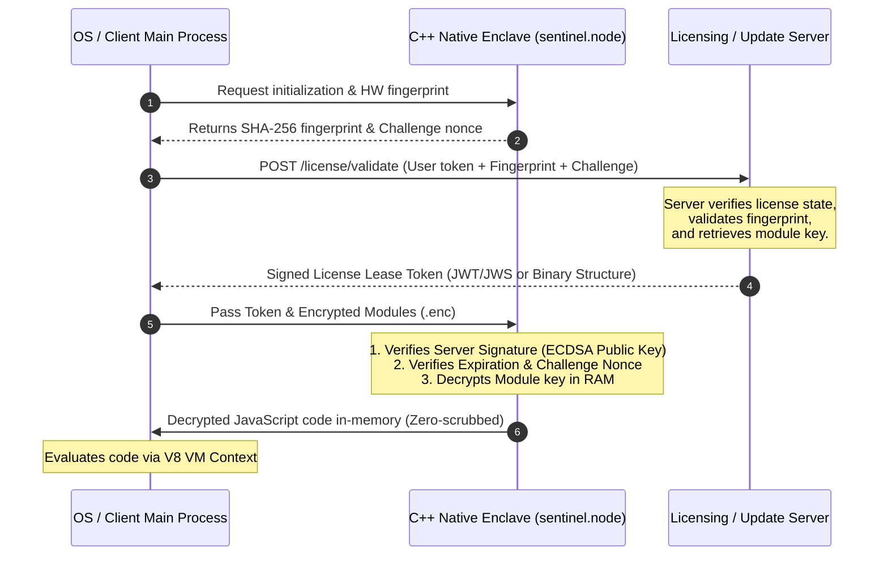

# RFC: Cryptographic License Lease & Dynamic Key Delivery Architecture
## Document Status: Proposal for External Security Review

This document proposes a hardening extension to the **Sentinel Cryptographic & Enclave Security Architecture (SCESA)** currently implemented in the GS Center application. 

The goal of this proposal is to mitigate client-side bypasses where attackers block network update/licensing checks (via firewall rules, DNS sinkholing, or local hosts file routing) to run outdated or modified versions of the application indefinitely.

---

## 1. Threat Landscape & Problem Statement

### 1.1 The Vulnerability
Currently, the application uses **ChaCha20 symmetric encryption** to protect core business logic modules (`tweaks.js`, `cleaners.js`). However, the symmetric key and initialization vector (IV) are statically compiled into the client-side binary. 

Because the app is designed to fall back to running normally when offline or when connection to the update server fails, an attacker can:
1. Block network access to `api.github.com` and licensing endpoints.
2. The app's update check fails and falls back to loading local execution blocks.
3. The app remains functional, bypassing updates and server-side revocation lists.

### 1.2 Security Target
To bind the execution of local files dynamically to a valid, online server-side license verification check. If the client is offline or blocked from the licensing server beyond a designated lease period, the application **must become mathematically incapable of execution**.

---

## 2. Proposed Architecture: Cryptographic Gating

We propose removing the static decryption keys from the client-side application. Instead, keys will be delivered dynamically by the server inside a signed, time-bound license lease token.

---

## 3. Cryptographic and Protocol Details

### 3.1 Build-Time Preparation
* Core modules (`tweaks.js`, `cleaners.js`) are encrypted at build time using **ChaCha20** with a unique key per release version.
* The decryption key for the specific version is stored on the server's secure database, indexed by the release build version.
* The client binary is packaged *without* the decryption key. It only contains a hardcoded **Server ECDSA Public Key**.

### 3.2 Runtime Authentication & Key Wrapping
Upon application startup:
1. The native enclave (`sentinel.node`) generates a cryptographically secure random number (a **Nonce**) to prevent replay attacks.
2. The main process sends a validation request containing:
   * Current Release Version
   * User Authentication Token
   * Nonce
   * Hardware Fingerprint (SHA-256 hash of CPUID + Motherboard Serial + Volume Serial)
3. If the license is valid, the server generates a payload containing:
   * `session_key`: The ChaCha20 decryption key for the requested version, encrypted/wrapped using a session key derived via **ECDH (Elliptic Curve Diffie-Hellman)** or encrypted with **RSA-OAEP**.
   * `expiry_timestamp`: Absolute UTC timestamp when this lease expires.
   * `nonce`: Echoed from the client's request to verify freshness.
   * `hw_fingerprint`: Echoed client hardware fingerprint.
4. The server signs the entire payload using its **ECDSA Private Key**.

### 3.3 Client-Side Decryption & Verification
1. The payload is passed into the native C++ enclave.
2. The enclave verifies the signature using the hardcoded **ECDSA Public Key**. If the signature is invalid, execution terminates.
3. The enclave checks if `expiry_timestamp` has passed (see Section 4 for time-tampering protections).
4. The enclave checks that `nonce` matches the generated startup challenge.
5. The enclave unwraps/decrypts the `session_key` in native memory, performs the ChaCha20 decryption of `tweaks.enc` and `cleaners.enc`, compiles them into the V8 context, and immediately **zero-scrubs** the key and decrypted buffers from RAM.

---

## 4. Addressing Operational Risks & Bypasses

### 4.1 Threat: Network Blocking (DNS/Hosts File)
* **Attack**: Attacker maps licensing domains to `127.0.0.1` or blocks them in a local firewall to run an old or cracked version.
* **Mitigation (Sliding-Window Lease)**: The client caches the signed lease token locally. On launch, if the server is unreachable, the client checks the cached token's `expiry_timestamp`. 
  * If the token is still valid (e.g., within a 3-day or 7-day sliding window), the app runs offline.
  * If the token has expired, the app refuses to boot. The user is forced to unblock the network to fetch a new lease.

### 4.2 Threat: Client Clock Tampering
* **Attack**: Attacker backdates their Windows system clock to bypass the `expiry_timestamp`.
* **Mitigation**: 
  * **Server-Relative Offsets**: The server sends its current UTC time in the signed token. The client calculates the offset between its local system clock and the server's clock. During execution, it verifies elapsed time relative to this offset rather than relying on raw system time.
  * **Enclave Tick Counts**: The C++ enclave queries the monotonic system clock (e.g., `QueryPerformanceCounter` or `GetTickCount64` on Windows) which cannot be modified by changing the system date/time. The elapsed time is verified against these ticks during a session.

### 4.3 Threat: False Positives in Hardware Upgrades
* **Attack**: A legitimate user changes their CPU or RAM, altering their hardware fingerprint, causing a false piracy lockout.
* **Mitigation (Fuzzy Fingerprint Matching)**: 
  * The fingerprint is calculated as a combined profile of multiple values: CPUID, Motherboard Serial Number, and Disk Volume Serial.
  * The verification algorithm allows a partial match (e.g., 2 out of 3 components must match). If a partial match occurs, the server automatically updates the user's registered HWID profile in the database with the new hardware components, preventing support tickets.

---

## 5. Security Consultant Feedback Questionnaire

*To be answered by the reviewing Security Architect:*

1. **Key Exchange Protocol**: Do you recommend utilizing **ECDH** (Ephemeral Diffie-Hellman) for session key derivation, or is standard **RSA-OAEP** key wrapping sufficient for client-server key transfer in this desktop environment?
2. **Offline Lease Lifespan**: Considering a utility/optimizer desktop app, does a **7-day sliding lease window** strike the right balance between user convenience (handling ISP issues/offline travel) and mitigation of offline bypass attempts?
3. **Time-Tampering Mitigation**: How would you rate the effectiveness of combining Windows monotonic clocks (`GetTickCount64`) with server-relative time offsets to prevent local date backdating? Is there a more resilient method?
4. **Enclave Memory Dumping**: Since the decrypted JavaScript source code must eventually be passed to Node's `vm.Script` in memory, are there standard V8 hardening flags or memory protection APIs (e.g., `VirtualProtect` on Windows) you recommend to prevent heap-dump extraction of the decrypted code?
